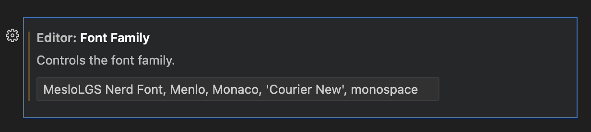

# Zsh Modular Configuration

A comprehensive modular Zsh setup for improved performance and maintainability.

> **Note:** After installation, refer to the `.zsh/README.md` file in your home directory for usage and customization instructions.

## Quick Installation

Install the latest release with a single command:

```bash
curl -fsSL https://raw.githubusercontent.com/kentmartin73/zshrc/latest/install.sh | bash
```

Install the latest HEAD:

```bash
curl -fsSL https://raw.githubusercontent.com/kentmartin73/zshrc/refs/heads/main/install.sh | bash
```


**Important:** Do not run the installation script from within iTerm2. The script will modify iTerm2 settings, so it should be run from another terminal like the built-in Terminal app.

**Note:** After installation, the script will automatically clean up unnecessary files, keeping only what's needed for the configuration to work.

> **⚠️ Important:** If you are connecting from another system (e.g., via SSH), you will still need to install the "MesloLGS Nerd Font" on the system you are connecting from to properly display all Powerlevel10k icons. Download the font from [nerdfonts.com](https://www.nerdfonts.com/font-downloads) or install it via your system's package manager.

### Font Setup in Other Applications

You should set your font to "MesloLGS Nerd Font" in other applications, for example in VS Code:

1. Change the font in VS Code to "MesloLGS Nerd Font" to properly display all Powerlevel10k icons:
   - Open VS Code Settings (Cmd+, on macOS or Ctrl+, on Windows/Linux)
   - Search for "font family"
   - Add "MesloLGS NF" to the beginning of the font family list
   - Example: `"MesloLGS NF", Menlo, Monaco, 'Courier New', monospace`



## Features

- **Performance Optimizations**: Lazy loading of commands and completions
- **Plugin Management**: Using Antigen with carefully selected plugins
- **Completions**: Comprehensive completion system with lazy loading
- **Theme**: Powerlevel10k with context-aware prompt elements
- **First-Run Setup**: Automatic installation of required utilities
- **macOS Enhancements**: iTerm2 configuration with Homebrew theme and Meslo Nerd Font
- **Modular Organization**: Each aspect of the configuration is in its own file

## Installation (Manual)

```bash
# Clone the repository
git clone https://github.com/kentmartin73/zshrc.git

# Run the installation script
cd zshrc
./install.sh
```

**Note:** Do not run the installation script from within iTerm2. The script will modify iTerm2 settings, so it should be run from another terminal like the built-in Terminal app.

## Directory Structure

```
.zsh/                # Main configuration directory
├── zshrc            # Main config file (copied to ~/.zsh/zshrc during setup)
├── conf.d/          # Configuration files loaded in numerical order
│   ├── 01-common.zsh       # Common variables and settings
│   ├── 05-performance.zsh  # Performance optimizations
│   ├── 10-options.zsh      # Zsh options and settings
│   ├── 15-history.zsh      # History configuration
│   ├── 20-plugins.zsh      # Plugin management (Antigen)
│   ├── 25-completions.zsh  # Completion settings
│   ├── 30-theme.zsh        # Theme settings (Powerlevel10k)
│   ├── 35-aliases.zsh      # All command aliases
│   ├── 40-functions.zsh    # Custom shell functions
│   ├── 45-macos_setup.zsh  # macOS-specific setup (iTerm2, fonts, etc.)
│   └── 50-local.zsh        # Machine-specific settings (gitignored)
├── lazy/            # Directory for lazy-loaded completions
└── tools.d/         # Tool-specific configurations
```

## Customization

- Machine-specific settings can be added to `~/.zsh/conf.d/50-local.zsh` (copy from `50-local.zsh.template`)
- Custom aliases can be added to `~/.zsh/conf.d/35-aliases.zsh`
- Custom functions can be added to `~/.zsh/conf.d/40-functions.zsh`
- New configuration files can be added to the `~/.zsh/conf.d/` directory with appropriate numbering
- See `~/.zsh/README.md` for more details on the numbering scheme and best practices

## Requirements

- Zsh (version 5.0 or later recommended)
- Git (for initial setup and plugin management)
- Antigen (for plugin management)

## Optional Tools

The configuration will attempt to install these tools on first run:

- dust (modern replacement for du)
- lsd (modern replacement for ls)
- neovim (modern vim)
- bat (modern replacement for cat)
- fd (modern replacement for find)
- duf (modern replacement for df)
- zoxide (smart cd command)

On macOS, it's also recommended to install GNU coreutils for better compatibility with Linux:

```bash
brew install coreutils findutils gnu-tar gnu-sed gawk gnutls gnu-indent gnu-getopt grep
```


## Uninstallation

If you need to revert to your previous Zsh configuration or completely uninstall this setup, please refer to the [REVERT.md](REVERT.md) file for detailed instructions.

## Testing and Troubleshooting

### Testing Performance

You can test the startup performance of your Zsh configuration:

```bash
# Measure shell startup time
time zsh -i -c exit
```

### Troubleshooting

If you encounter issues with your Zsh configuration:

1. **Plugin Loading Issues**
   - Check if Antigen is properly installed
   - Verify plugin paths in `~/.zsh/conf.d/20-plugins.zsh`

2. **Completion Problems**
   - Clear the completion cache: `rm -rf ~/.zsh/cache/*`
   - Regenerate completions: `compinit -d ~/.zcompdump; zcompile ~/.zcompdump`

3. **Performance Issues**
   - Use the profiling functions to identify bottlenecks:
     ```bash
     # Add these lines to your .zshrc to enable profiling
     zmodload zsh/zprof
     # At the end of your session, run:
     zprof
     ```
   - Consider disabling heavy plugins temporarily

4. **Powerlevel10k Issues**
   - Run `p10k configure` to set up the theme
   - Verify that the theme is properly loaded in `~/.zsh/conf.d/20-plugins.zsh`