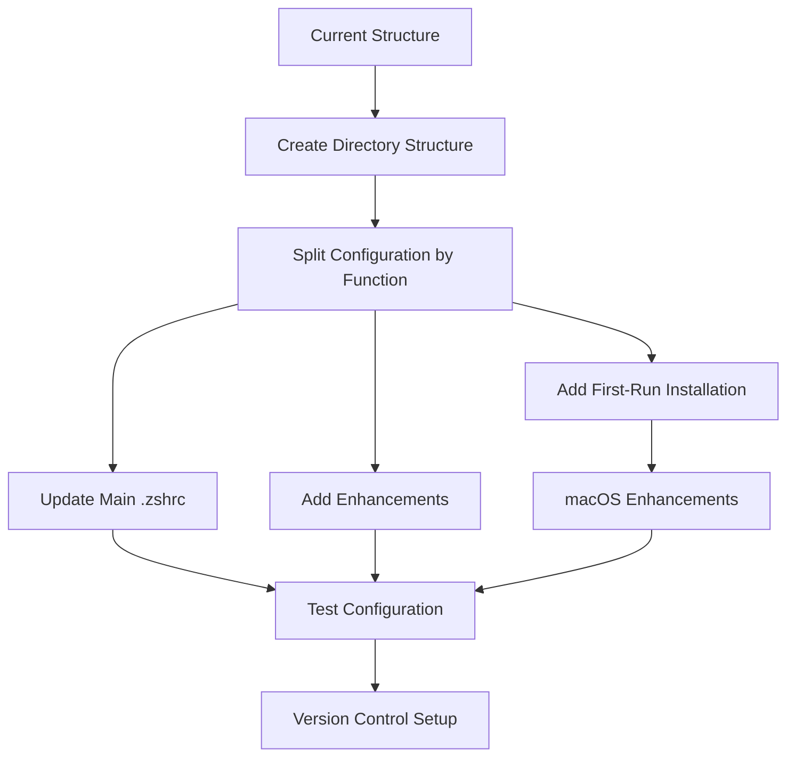

# Comprehensive Zsh Modular Configuration Plan

This document outlines a detailed plan for reorganizing your zsh configuration into a modular structure with enhanced functionality, improved performance, and better maintainability.



## Table of Contents

1. [Directory Structure](#1-directory-structure)
2. [File Contents](#2-file-contents)
3. [Implementation Steps](#3-implementation-steps)
4. [Setup Script](#4-setup-script-optional)

## 1. Directory Structure

The modular organization will use the following directory structure:

```
~/.zsh/
├── .zshrc              # Main config file (symlinked to ~/.zshrc)
├── aliases.zsh         # All command aliases
├── functions.zsh       # Custom shell functions
├── plugins.zsh         # Plugin management (Antigen)
├── completions.zsh     # Completion settings
├── lazy/               # Directory for lazy-loaded completions
├── theme.zsh           # Theme settings (Powerlevel10k)
├── history.zsh         # History configuration
├── options.zsh         # Zsh options and settings
├── keybindings.zsh     # Custom key bindings
├── performance.zsh     # Performance optimizations
├── local.zsh           # Machine-specific settings (gitignored)
├── macos_setup.zsh     # macOS-specific setup (iTerm2, fonts, etc.)
└── .setup_complete     # Marker file to indicate setup is complete
## 2. File Contents

### ~/.zsh/.zshrc (Main Configuration)

```zsh
# Main zsh configuration file
# Sources all modular configuration files

# Enable Powerlevel10k instant prompt
if [[ -r "${XDG_CACHE_HOME:-$HOME/.cache}/p10k-instant-prompt-${(%):-%n}.zsh" ]]; then
  source "${XDG_CACHE_HOME:-$HOME/.cache}/p10k-instant-prompt-${(%):-%n}.zsh"
fi

# Check for first run and install required utilities if needed
if [[ ! -f ~/.zsh/.setup_complete ]]; then
  echo "First run detected. Installing required utilities..."
  
  # Detect operating system
  if [[ "$OSTYPE" == "darwin"* ]]; then
    # macOS - use Homebrew if available
    if command -v brew &>/dev/null; then
      echo "Installing utilities with Homebrew..."
      brew install dust lsd neovim bat fd duf
      
      # Source macOS-specific setup
      source ~/.zsh/macos_setup.zsh
    else
      echo "Homebrew not found. Please install manually: dust, lsd, neovim, bat, fd, duf"
    fi
  elif [[ -f /etc/debian_version ]]; then
    # Debian/Ubuntu
    if command -v apt &>/dev/null && sudo -n true 2>/dev/null; then
      echo "Installing utilities with apt..."
      sudo apt update
      sudo apt install -y dust lsd neovim bat fd-find duf
    else
      echo "Cannot install with apt. Please install manually: dust, lsd, neovim, bat, fd-find, duf"
    fi
  elif [[ -f /etc/fedora-release ]]; then
    # Fedora
    if command -v dnf &>/dev/null && sudo -n true 2>/dev/null; then
      echo "Installing utilities with dnf..."
      sudo dnf install -y dust lsd neovim bat fd duf
    else
      echo "Cannot install with dnf. Please install manually: dust, lsd, neovim, bat, fd, duf"
    fi
  elif [[ -f /etc/arch-release ]]; then
    # Arch Linux
    if command -v pacman &>/dev/null && sudo -n true 2>/dev/null; then
      echo "Installing utilities with pacman..."
      sudo pacman -S --noconfirm dust lsd neovim bat fd duf
    else
      echo "Cannot install with pacman. Please install manually: dust, lsd, neovim, bat, fd, duf"
    fi
  else
    echo "Unknown OS. Please install manually: dust, lsd, neovim, bat, fd, duf"
  fi
  
  # Create marker file to indicate setup is complete
  touch ~/.zsh/.setup_complete
  
  echo "First-run setup complete."
fi

# Source performance optimizations first
source ~/.zsh/performance.zsh

# Source all other configuration files
for config_file (~/.zsh/*.zsh); do
  if [[ "$config_file" != "$HOME/.zsh/macos_setup.zsh" && "$config_file" != "$HOME/.zsh/performance.zsh" ]]; then
    source $config_file
  fi
done

### ~/.zsh/performance.zsh

```zsh
# Performance optimizations for zsh

# Uncomment these lines to profile zsh startup time
# zmodload zsh/zprof

# Function to lazy load commands
function lazy_load() {
  local load_func=$1
  local cmd=$2
  
  eval "$cmd() { unfunction $cmd; $load_func; $cmd \$@ }"
}

# Example: Lazy load nvm if it exists
if [ -d "$HOME/.nvm" ]; then
  lazy_load 'source ~/.nvm/nvm.sh' nvm
fi

# Function to lazy load completions
function lazy_load_completion() {
  local command=$1
  local completion_file=$2
  
  # Only load completion when the command is first used
  eval "
  function $command() {
    # Remove this function
    unfunction $command
    
    # Load completion
    if [[ -f $completion_file ]]; then
      source $completion_file
    fi
    
    # Execute the command
    $command \"\$@\"
  }
  "
}

# Create directory for lazy-loaded completions
mkdir -p ~/.zsh/lazy

# Enhanced completion caching
zstyle ':completion:*' use-cache on
zstyle ':completion:*' cache-path ~/.zsh/cache
zstyle ':completion:*' accept-exact '*(N)'
### ~/.zsh/macos_setup.zsh

```zsh
# macOS-specific setup for iTerm2, fonts, and themes
# This file is only sourced during first-run setup on macOS

echo "Setting up macOS enhancements..."

# Install iTerm2
if ! brew list --cask iterm2 &>/dev/null; then
  echo "Installing iTerm2..."
  brew install --cask iterm2
fi

# Install Meslo Nerd Font (recommended for Powerlevel10k)
if ! brew list --cask font-meslo-lg-nerd-font &>/dev/null; then
  echo "Installing Meslo Nerd Font..."
  brew tap homebrew/cask-fonts
  brew install --cask font-meslo-lg-nerd-font
fi

# Download and install the Homebrew theme for iTerm2
echo "Installing Homebrew theme for iTerm2..."

# Create temporary directory for theme files
TEMP_DIR=$(mktemp -d)
cd "$TEMP_DIR"

# Clone the iTerm2-Color-Schemes repository to get the Homebrew theme
git clone --depth=1 https://github.com/mbadolato/iTerm2-Color-Schemes.git
cd iTerm2-Color-Schemes

# Install the Homebrew theme
open "schemes/Homebrew.itermcolors"

# Wait a moment for the theme to be imported
sleep 2

# Create a temporary script to configure iTerm2
ITERM_CONFIG_SCRIPT=$(mktemp)
cat > "$ITERM_CONFIG_SCRIPT" << 'EOL'
#!/bin/bash

# Script to configure iTerm2 with Homebrew theme and Meslo font

# Set the default profile to use Homebrew theme
defaults write com.googlecode.iterm2 "Default Bookmark Guid" -string "Homebrew"

# Set the font to Meslo Nerd Font
/usr/libexec/PlistBuddy -c "Set 'New Bookmarks':0:'Normal Font' 'MesloLGSNerdFontComplete-Regular 12'" ~/Library/Preferences/com.googlecode.iterm2.plist
/usr/libexec/PlistBuddy -c "Set 'New Bookmarks':0:'Non Ascii Font' 'MesloLGSNerdFontComplete-Regular 12'" ~/Library/Preferences/com.googlecode.iterm2.plist

echo "iTerm2 configured with Homebrew theme and Meslo Nerd Font."
echo "Please restart iTerm2 for changes to take effect."
EOL

# Make the script executable
chmod +x "$ITERM_CONFIG_SCRIPT"

# Run the configuration script
echo "Configuring iTerm2 automatically..."
"$ITERM_CONFIG_SCRIPT"

# Clean up
rm -f "$ITERM_CONFIG_SCRIPT"
cd
rm -rf "$TEMP_DIR"

echo "iTerm2 has been configured with Homebrew theme and Meslo Nerd Font."
echo "Please restart iTerm2 for changes to take effect."
### ~/.zsh/plugins.zsh

```zsh
# Plugin management with Antigen

# Load Antigen (OS-specific path)
if [[ -f ~/.zsh/antigen_path.zsh ]]; then
  source ~/.zsh/antigen_path.zsh
else
  # Default macOS Homebrew path
  source /opt/homebrew/share/antigen/antigen.zsh 2>/dev/null || \
  # Alternative Homebrew path
  source /usr/local/share/antigen/antigen.zsh 2>/dev/null || \
  # Fallback to home directory
  source $HOME/antigen.zsh 2>/dev/null || \
  echo "Warning: Antigen not found. Plugin management disabled."
fi

# Only load plugins if Antigen is available
if type antigen > /dev/null 2>&1; then
  # Antigen plugins
  antigen bundle command-not-found
  antigen bundle z-shell/F-Sy-H --branch=main
  ZSH_HIGHLIGHT_HIGHLIGHTERS=(main brackets pattern regexp cursor root line)
  antigen bundle zsh-users/zsh-autosuggestions
  antigen bundle zsh-users/zsh-completions
  antigen bundle colored-man-pages
  antigen bundle colorize
  antigen bundle dirpersist
  antigen bundle history-substring-search
  
  # Replace zsh-z with zoxide
  antigen bundle ajeetdsouza/zoxide
  
  # Add urltools plugin
  antigen bundle ohmyzsh/ohmyzsh plugins/urltools
  
  antigen bundle trystan2k/zsh-tab-title
  antigen theme romkatv/powerlevel10k
  antigen bundle marlonrichert/zsh-autocomplete@22.02.21
### ~/.zsh/aliases.zsh

```zsh
# Command aliases

# === Disk usage (dust wrapper) ===
du2dust() {
  if ! command -v dust >/dev/null 2>&1; then
    echo "Command \`dust\` not found. Using standard du instead." >&2
    du -h "$@"
    return $?
  fi
  case "$1" in
    -sh)
      dust --depth 1 "${@:2}"
      ;;
    *)
      dust --depth 1 "$@"
      ;;
  esac
}
alias du='du2dust'

# === Filesystem listing ===
if command -v lsd &>/dev/null; then
  alias ls='lsd'
fi

# === Text editing and viewing ===
if command -v nvim &>/dev/null; then
  alias vi='nvim'
  alias vim='nvim'
fi

if command -v bat &>/dev/null; then
  alias cat='bat'
  alias less='bat'
fi

# === Disk free replacement ===
if command -v duf &>/dev/null; then
  alias df='duf'
fi
```

### ~/.zsh/functions.zsh

```zsh
# Custom shell functions

# You can add your custom functions here
```

### ~/.zsh/theme.zsh

```zsh
# Powerlevel10k theme configuration

# Context-aware prompt
typeset -g POWERLEVEL9K_LEFT_PROMPT_ELEMENTS=(os_icon dir vcs node_version virtualenv)
typeset -g POWERLEVEL9K_RIGHT_PROMPT_ELEMENTS=(status command_execution_time time)

# Show Node.js version only when package.json or node_modules exists
typeset -g POWERLEVEL9K_NODE_VERSION_PROJECT_ONLY=true

# Show Python version only when .py files or virtual environment exists
typeset -g POWERLEVEL9K_VIRTUALENV_SHOW_PYTHON_VERSION=true
typeset -g POWERLEVEL9K_VIRTUALENV_GENERIC_NAMES=(virtualenv venv .venv env)
```
  antigen bundle zdharma-continuum/history-search-multi-word
### ~/.zsh/completions.zsh (Part 1)

```zsh
# Completion system configuration

# Initialize the completion system
autoload -Uz compinit
compinit

# Cache completion to speed things up
zstyle ':completion:*' use-cache on
zstyle ':completion:*' cache-path ~/.zsh/cache

# Menu selection for completion
zstyle ':completion:*' menu select

# Case-insensitive (all), partial-word, and then substring completion
zstyle ':completion:*' matcher-list 'm:{a-zA-Z}={A-Za-z}' 'r:|[._-]=* r:|=*' 'l:|=* r:|=*'

# Colorize completions using default `ls` colors
zstyle ':completion:*' list-colors "${(s.:.)LS_COLORS}"

# Better completion grouping
zstyle ':completion:*:descriptions' format '%F{yellow}-- %d --%f'
zstyle ':completion:*:messages' format '%F{purple}-- %d --%f'
zstyle ':completion:*:warnings' format '%F{red}-- no matches found --%f'
zstyle ':completion:*:default' list-prompt '%S%M matches%s'
zstyle ':completion:*' group-name ''

# Fuzzy matching of completions
zstyle ':completion:*' completer _complete _match _approximate
zstyle ':completion:*:match:*' original only
zstyle ':completion:*:approximate:*' max-errors 1 numeric

# Increase the number of errors allowed based on the length of the typed word
zstyle -e ':completion:*:approximate:*' max-errors 'reply=($((($#PREFIX+$#SUFFIX)/3))numeric)'

# Don't complete unavailable commands
zstyle ':completion:*:functions' ignored-patterns '(_*|pre(cmd|exec))'

# Array completion element sorting
zstyle ':completion:*:*:-subscript-:*' tag-order indexes parameters

# Directories
zstyle ':completion:*:*:cd:*' tag-order local-directories directory-stack path-directories
zstyle ':completion:*:*:cd:*:directory-stack' menu yes select
zstyle ':completion:*:-tilde-:*' group-order 'named-directories' 'path-directories' 'users' 'expand'
zstyle ':completion:*' squeeze-slashes true

# History
### ~/.zsh/completions.zsh (Part 2 - Lazy Loading Setup)

```zsh
# Setup lazy loading for various completions
# Git completions
if command -v git &>/dev/null; then
  mkdir -p ~/.zsh/lazy
  curl -o ~/.zsh/lazy/git-completion.bash https://raw.githubusercontent.com/git/git/master/contrib/completion/git-completion.bash 2>/dev/null
  curl -o ~/.zsh/lazy/_git https://raw.githubusercontent.com/git/git/master/contrib/completion/git-completion.zsh 2>/dev/null
  lazy_load_completion git "~/.zsh/lazy/_git"
fi

# Docker completions
if command -v docker &>/dev/null; then
  mkdir -p ~/.zsh/lazy
  curl -L https://raw.githubusercontent.com/docker/cli/master/contrib/completion/zsh/_docker > ~/.zsh/lazy/_docker 2>/dev/null
  lazy_load_completion docker "~/.zsh/lazy/_docker"
fi

# Docker Compose completions
if command -v docker-compose &>/dev/null; then
  mkdir -p ~/.zsh/lazy
  curl -L https://raw.githubusercontent.com/docker/compose/master/contrib/completion/zsh/_docker-compose > ~/.zsh/lazy/_docker-compose 2>/dev/null
  lazy_load_completion docker-compose "~/.zsh/lazy/_docker-compose"
fi

# npm completions
if command -v npm &>/dev/null; then
  mkdir -p ~/.zsh/lazy
  npm completion > ~/.zsh/lazy/_npm 2>/dev/null
  lazy_load_completion npm "~/.zsh/lazy/_npm"
fi

# pip completions
if command -v pip &>/dev/null; then
  mkdir -p ~/.zsh/lazy
  pip completion --zsh > ~/.zsh/lazy/_pip 2>/dev/null
  lazy_load_completion pip "~/.zsh/lazy/_pip"
fi

# SSH host completions
h=()
if [[ -r ~/.ssh/config ]]; then
  h=($h ${${${(@M)${(f)"$(cat ~/.ssh/config)"}:#Host *}#Host }:#*[*?]*})
fi
if [[ -r ~/.ssh/known_hosts ]]; then
  h=($h ${${${(f)"$(cat ~/.ssh/known_hosts{,2} || true)"}%%\ *}%%,*}) 
fi
if [[ $#h -gt 0 ]]; then
  zstyle ':completion:*:ssh:*' hosts $h
### ~/.zsh/completions.zsh (Part 3 - More Completions)

```zsh
# Kubectl completions
if command -v kubectl &>/dev/null; then
  mkdir -p ~/.zsh/lazy
  kubectl completion zsh > ~/.zsh/lazy/_kubectl 2>/dev/null
  lazy_load_completion kubectl "~/.zsh/lazy/_kubectl"
fi

# AWS CLI completions
if command -v aws &>/dev/null; then
  mkdir -p ~/.zsh/lazy
  complete -C aws_completer aws
fi

# Azure CLI completions
if command -v az &>/dev/null; then
  mkdir -p ~/.zsh/lazy
  az completion zsh > ~/.zsh/lazy/_az 2>/dev/null
  lazy_load_completion az "~/.zsh/lazy/_az"
fi

# Google Cloud CLI completions
if command -v gcloud &>/dev/null; then
  lazy_load 'source "$(gcloud info --format="value(config.paths.completion_path)")"' gcloud
fi

# Terraform completions
if command -v terraform &>/dev/null; then
  mkdir -p ~/.zsh/lazy
  terraform -install-autocomplete 2>/dev/null
  lazy_load_completion terraform "~/.zsh/lazy/_terraform"
fi

# Homebrew completions
if command -v brew &>/dev/null; then
  FPATH="$(brew --prefix)/share/zsh/site-functions:${FPATH}"
fi

# Man page completions
zstyle ':completion:*:manuals' separate-sections true
zstyle ':completion:*:manuals.(^1*)' insert-sections true
zstyle ':completion:*:man:*' menu yes select

# Rust/Cargo completions
if command -v rustc &>/dev/null; then
  mkdir -p ~/.zsh/lazy
  rustup completions zsh > ~/.zsh/lazy/_rustup 2>/dev/null
  rustup completions zsh cargo > ~/.zsh/lazy/_cargo 2>/dev/null
### ~/.zsh/completions.zsh (Part 4 - Additional Completions)

```zsh
# Ruby/Gem/Bundler completions
if command -v bundle &>/dev/null; then
  mkdir -p ~/.zsh/lazy
  curl -L https://raw.githubusercontent.com/zsh-users/zsh-completions/master/src/_bundle > ~/.zsh/lazy/_bundle 2>/dev/null
  lazy_load_completion bundle "~/.zsh/lazy/_bundle"
fi

# GitHub CLI completions
if command -v gh &>/dev/null; then
  mkdir -p ~/.zsh/lazy
  gh completion -s zsh > ~/.zsh/lazy/_gh 2>/dev/null
  lazy_load_completion gh "~/.zsh/lazy/_gh"
fi

# GitLab CLI completions
if command -v glab &>/dev/null; then
  mkdir -p ~/.zsh/lazy
  glab completion -s zsh > ~/.zsh/lazy/_glab 2>/dev/null
  lazy_load_completion glab "~/.zsh/lazy/_glab"
fi

# Vagrant completions
if command -v vagrant &>/dev/null; then
  mkdir -p ~/.zsh/lazy
  curl -L https://raw.githubusercontent.com/hashicorp/vagrant/main/contrib/zsh/_vagrant > ~/.zsh/lazy/_vagrant 2>/dev/null
  lazy_load_completion vagrant "~/.zsh/lazy/_vagrant"
fi

# Composer completions
if command -v composer &>/dev/null; then
  mkdir -p ~/.zsh/lazy
  curl -L https://raw.githubusercontent.com/zsh-users/zsh-completions/master/src/_composer > ~/.zsh/lazy/_composer 2>/dev/null
  lazy_load_completion composer "~/.zsh/lazy/_composer"
fi

# Maven completions
if command -v mvn &>/dev/null; then
  mkdir -p ~/.zsh/lazy
  curl -L https://raw.githubusercontent.com/zsh-users/zsh-completions/master/src/_mvn > ~/.zsh/lazy/_mvn 2>/dev/null
  lazy_load_completion mvn "~/.zsh/lazy/_mvn"
fi

# Gradle completions
if command -v gradle &>/dev/null; then
  mkdir -p ~/.zsh/lazy
  curl -L https://raw.githubusercontent.com/zsh-users/zsh-completions/master/src/_gradle > ~/.zsh/lazy/_gradle 2>/dev/null
  lazy_load_completion gradle "~/.zsh/lazy/_gradle"
### ~/.zsh/completions.zsh (Part 5 - Final Completions)

```zsh
# Helm completions
if command -v helm &>/dev/null; then
  mkdir -p ~/.zsh/lazy
  helm completion zsh > ~/.zsh/lazy/_helm 2>/dev/null
  lazy_load_completion helm "~/.zsh/lazy/_helm"
fi

# Database completions (MongoDB, PostgreSQL, MySQL)
if command -v mongo &>/dev/null; then
  mkdir -p ~/.zsh/lazy
  curl -L https://raw.githubusercontent.com/zsh-users/zsh-completions/master/src/_mongodb > ~/.zsh/lazy/_mongodb 2>/dev/null
  lazy_load_completion mongo "~/.zsh/lazy/_mongodb"
fi

if command -v psql &>/dev/null; then
  mkdir -p ~/.zsh/lazy
  curl -L https://raw.githubusercontent.com/zsh-users/zsh-completions/master/src/_postgresql > ~/.zsh/lazy/_postgresql 2>/dev/null
  lazy_load_completion psql "~/.zsh/lazy/_postgresql"
fi

if command -v mysql &>/dev/null; then
  mkdir -p ~/.zsh/lazy
  curl -L https://raw.githubusercontent.com/zsh-users/zsh-completions/master/src/_mysql > ~/.zsh/lazy/_mysql 2>/dev/null
  lazy_load_completion mysql "~/.zsh/lazy/_mysql"
fi

# Version manager completions (nvm, pyenv, rbenv)
if command -v nvm &>/dev/null; then
  mkdir -p ~/.zsh/lazy
  curl -L https://raw.githubusercontent.com/zsh-users/zsh-completions/master/src/_nvm > ~/.zsh/lazy/_nvm 2>/dev/null
  lazy_load_completion nvm "~/.zsh/lazy/_nvm"
fi

if command -v pyenv &>/dev/null; then
  lazy_load 'eval "$(pyenv init -)"' pyenv
fi

if command -v rbenv &>/dev/null; then
  lazy_load 'eval "$(rbenv init -)"' rbenv
fi

# tmux completions
if command -v tmux &>/dev/null; then
  mkdir -p ~/.zsh/lazy
  curl -L https://raw.githubusercontent.com/zsh-users/zsh-completions/master/src/_tmux > ~/.zsh/lazy/_tmux 2>/dev/null
  lazy_load_completion tmux "~/.zsh/lazy/_tmux"
fi

# Package manager completions (apt, dnf, pacman)
if command -v apt &>/dev/null; then
  # apt completions are usually included by default
  zstyle ':completion:*:apt:*' force-list always
  zstyle ':completion:*:*:apt:*' menu yes select
fi

if command -v dnf &>/dev/null; then
  # dnf completions are usually included by default
  zstyle ':completion:*:dnf:*' force-list always
  zstyle ':completion:*:*:dnf:*' menu yes select
fi

if command -v pacman &>/dev/null; then
  # pacman completions are usually included by default
  zstyle ':completion:*:pacman:*' force-list always
  zstyle ':completion:*:*:pacman:*' menu yes select
fi

### ~/.zsh/history.zsh

```zsh
# History configuration

HISTFILE=~/.zsh_history
HISTSIZE=10000
SAVEHIST=10000

# History options
setopt EXTENDED_HISTORY       # Save timestamp
setopt HIST_EXPIRE_DUPS_FIRST # Delete duplicates first when HISTFILE size exceeds HISTSIZE
setopt HIST_IGNORE_DUPS       # Don't record duplicates
setopt SHARE_HISTORY          # Share history between sessions
```

### ~/.zsh/options.zsh

```zsh
# Zsh options and settings

# Directory navigation
setopt AUTO_PUSHD           # Make cd push the old directory onto the stack
setopt PUSHD_IGNORE_DUPS    # Don't push multiple copies

# Input/output
setopt INTERACTIVE_COMMENTS # Allow comments in interactive shells
setopt NO_BEEP              # No beep on error
```

### ~/.zsh/keybindings.zsh

```zsh
# Key bindings

# Use emacs key bindings
bindkey -e

# History substring search
bindkey '^[[A' history-substring-search-up
bindkey '^[[B' history-substring-search-down
```

### ~/.zsh/local.zsh (optional, gitignored)

```zsh
# Machine-specific settings
# This file is not tracked in version control

# Add any machine-specific configuration here
## 3. Implementation Steps

Follow these steps to implement the modular configuration:

### Step 1: Create the directory structure

```bash
mkdir -p ~/.zsh/lazy
```

### Step 2: Create the modular files

```bash
touch ~/.zsh/{aliases.zsh,functions.zsh,plugins.zsh,completions.zsh,theme.zsh,history.zsh,options.zsh,keybindings.zsh,performance.zsh,local.zsh,macos_setup.zsh}
```

### Step 3: Migrate content from existing files

1. Move content from `.alias` to `~/.zsh/aliases.zsh`
2. Move content from `.p10k.zsh` to `~/.zsh/theme.zsh`
3. Split content from `.zshrc` into appropriate files:
   - Plugin management → `plugins.zsh`
   - Any existing functions → `functions.zsh`
   - Any existing options → `options.zsh`
4. Create the new `performance.zsh` file with performance optimizations
5. Create the new `macos_setup.zsh` file with macOS-specific enhancements

### Step 4: Create the new main .zshrc in the ~/.zsh directory

```bash
# Create the new .zshrc
cp ~/.zshrc ~/.zsh/.zshrc
# Edit it to use the new structure (as shown above)
```

### Step 5: Replace the original .zshrc with a symlink

```bash
# Backup the original
mv ~/.zshrc ~/.zshrc.backup
mv ~/.alias ~/.alias.backup
mv ~/.p10k.zsh ~/.p10k.zsh.backup

# Create symlink
ln -s ~/.zsh/.zshrc ~/.zshrc
```

### Step 6: Test the configuration

```bash
# Start a new shell to test
zsh
```

### Step 7: Set up version control (optional but recommended)

```bash
cd ~/.zsh
git init
echo "local.zsh" > .gitignore
## 4. Setup Script (Optional)

For convenience, you can create a setup script that automates the migration process:

### ~/.zsh/setup.sh

```bash
#!/bin/bash

# Setup script for modular zsh configuration

# Create directory structure
mkdir -p ~/.zsh/lazy

# Create configuration files
touch ~/.zsh/{aliases.zsh,functions.zsh,plugins.zsh,completions.zsh,theme.zsh,history.zsh,options.zsh,keybindings.zsh,performance.zsh,local.zsh,macos_setup.zsh}

# Copy existing configuration files
cp ~/.alias ~/.zsh/aliases.zsh
cp ~/.p10k.zsh ~/.zsh/theme.zsh

# Create performance.zsh file
cat > ~/.zsh/performance.zsh << 'EOL'
# Performance optimizations for zsh

# Uncomment these lines to profile zsh startup time
# zmodload zsh/zprof

# Function to lazy load commands
function lazy_load() {
  local load_func=$1
  local cmd=$2
  
  eval "$cmd() { unfunction $cmd; $load_func; $cmd \$@ }"
}

# Example: Lazy load nvm if it exists
if [ -d "$HOME/.nvm" ]; then
  lazy_load 'source ~/.nvm/nvm.sh' nvm
fi

# Function to lazy load completions
function lazy_load_completion() {
  local command=$1
  local completion_file=$2
  
  # Only load completion when the command is first used
  eval "
  function $command() {
    # Remove this function
    unfunction $command
    
    # Load completion
    if [[ -f $completion_file ]]; then
      source $completion_file
    fi
    
    # Execute the command
    $command \"\$@\"
  }
  "
}

# Create directory for lazy-loaded completions
mkdir -p ~/.zsh/lazy

# Enhanced completion caching
zstyle ':completion:*' use-cache on
zstyle ':completion:*' cache-path ~/.zsh/cache
zstyle ':completion:*' accept-exact '*(N)'
zstyle ':completion:*' use-ip true

# Uncomment this line at the end of your .zshrc to see profiling results
# zprof
EOL

# Create the new main .zshrc
cat > ~/.zsh/.zshrc << 'EOL'
# Main zsh configuration file
# Sources all modular configuration files

# Enable Powerlevel10k instant prompt
if [[ -r "${XDG_CACHE_HOME:-$HOME/.cache}/p10k-instant-prompt-${(%):-%n}.zsh" ]]; then
  source "${XDG_CACHE_HOME:-$HOME/.cache}/p10k-instant-prompt-${(%):-%n}.zsh"
fi

# Check for first run and install required utilities if needed
if [[ ! -f ~/.zsh/.setup_complete ]]; then
  echo "First run detected. Installing required utilities..."
  
  # Detect operating system
  if [[ "$OSTYPE" == "darwin"* ]]; then
    # macOS - use Homebrew if available
    if command -v brew &>/dev/null; then
      echo "Installing utilities with Homebrew..."
      brew install dust lsd neovim bat fd duf
      
      # Source macOS-specific setup
      source ~/.zsh/macos_setup.zsh
    else
      echo "Homebrew not found. Please install manually: dust, lsd, neovim, bat, fd, duf"
    fi
  elif [[ -f /etc/debian_version ]]; then
    # Debian/Ubuntu
    if command -v apt &>/dev/null && sudo -n true 2>/dev/null; then
      echo "Installing utilities with apt..."
      sudo apt update
      sudo apt install -y dust lsd neovim bat fd-find duf
    else
      echo "Cannot install with apt. Please install manually: dust, lsd, neovim, bat, fd-find, duf"
    fi
  elif [[ -f /etc/fedora-release ]]; then
    # Fedora
    if command -v dnf &>/dev/null && sudo -n true 2>/dev/null; then
      echo "Installing utilities with dnf..."
      sudo dnf install -y dust lsd neovim bat fd duf
    else
      echo "Cannot install with dnf. Please install manually: dust, lsd, neovim, bat, fd, duf"
    fi
  elif [[ -f /etc/arch-release ]]; then
    # Arch Linux
    if command -v pacman &>/dev/null && sudo -n true 2>/dev/null; then
      echo "Installing utilities with pacman..."
      sudo pacman -S --noconfirm dust lsd neovim bat fd duf
    else
      echo "Cannot install with pacman. Please install manually: dust, lsd, neovim, bat, fd, duf"
    fi
  else
    echo "Unknown OS. Please install manually: dust, lsd, neovim, bat, fd, duf"
  fi
  
  # Create marker file to indicate setup is complete
  touch ~/.zsh/.setup_complete
  
  echo "First-run setup complete."
fi

# Source performance optimizations first
source ~/.zsh/performance.zsh

# Source all other configuration files
for config_file (~/.zsh/*.zsh); do
  if [[ "$config_file" != "$HOME/.zsh/macos_setup.zsh" && "$config_file" != "$HOME/.zsh/performance.zsh" ]]; then
    source $config_file
  fi
done

# Source local configuration if it exists (not in version control)
[[ -f ~/.zsh/local.zsh ]] && source ~/.zsh/local.zsh
EOL

# Backup original files
mv ~/.zshrc ~/.zshrc.backup
mv ~/.alias ~/.alias.backup
mv ~/.p10k.zsh ~/.p10k.zsh.backup

# Create symlink for .zshrc
ln -s ~/.zsh/.zshrc ~/.zshrc

# Initialize git repository
cd ~/.zsh
git init
echo "local.zsh" > .gitignore
echo ".setup_complete" >> .gitignore
echo "lazy/" >> .gitignore
git add .
git commit -m "Initial modular zsh configuration"

echo "Setup complete! Start a new shell to test the configuration."
```
echo ".setup_complete" >> .gitignore
echo "lazy/" >> .gitignore
git add .
git commit -m "Initial modular zsh configuration"
```

# To force a re-run of the first-time setup (e.g., to install missing utilities):
# rm -f ~/.zsh/.setup_complete
```
# Podman completions
if command -v podman &>/dev/null; then
  mkdir -p ~/.zsh/lazy
  curl -L https://raw.githubusercontent.com/containers/podman/main/completions/zsh/_podman > ~/.zsh/lazy/_podman 2>/dev/null
  lazy_load_completion podman "~/.zsh/lazy/_podman"
fi
```
fi

# Ansible completions
if command -v ansible &>/dev/null; then
  mkdir -p ~/.zsh/lazy
  curl -L https://raw.githubusercontent.com/zsh-users/zsh-completions/master/src/_ansible > ~/.zsh/lazy/_ansible 2>/dev/null
  lazy_load_completion ansible "~/.zsh/lazy/_ansible"
fi
```
  lazy_load_completion rustup "~/.zsh/lazy/_rustup"
  lazy_load_completion cargo "~/.zsh/lazy/_cargo"
fi

# Go completions
if command -v go &>/dev/null; then
  mkdir -p ~/.zsh/lazy
  go tool completion zsh > ~/.zsh/lazy/_go 2>/dev/null
  lazy_load_completion go "~/.zsh/lazy/_go"
fi
```
  zstyle ':completion:*:scp:*' hosts $h
  zstyle ':completion:*:sftp:*' hosts $h
fi
```
zstyle ':completion:*:history-words' stop yes
zstyle ':completion:*:history-words' remove-all-dups yes
zstyle ':completion:*:history-words' list false
zstyle ':completion:*:history-words' menu yes

# Completion for aliases
setopt completealiases
```
  antigen apply
fi
```
echo "After restarting iTerm2, you may want to run 'p10k configure' to optimize Powerlevel10k for your new font."
```
zstyle ':completion:*' use-ip true

# Uncomment this line at the end of your .zshrc to see profiling results
# zprof
```
# Source local configuration if it exists (not in version control)
[[ -f ~/.zsh/local.zsh ]] && source ~/.zsh/local.zsh
```