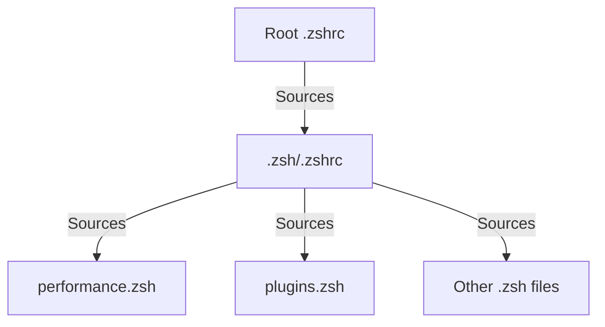
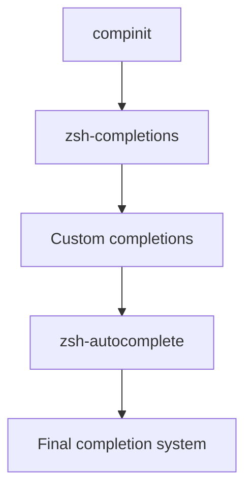

# ZSH Configuration Optimization Plan

Based on a thorough analysis of the current ZSH configuration, this document outlines a comprehensive plan to resolve plugin conflicts and redundancies, streamline the setup, and improve performance.

## 1. Consolidate Configuration Files



### Action Items:
1. **Simplify root `.zshrc`**:
   - Remove all plugin loading from the root `.zshrc`
   - Make it only source `.zsh/.zshrc`
   - Keep only the Powerlevel10k instant prompt initialization

2. **Create missing `macos_setup.zsh`**:
   - Add macOS-specific configurations
   - Include macOS terminal settings and environment variables

## 2. Fix Plugin Management

### Action Items:
1. **Consolidate all plugin loading in `plugins.zsh`**:
   - Remove duplicate plugin declarations
   - Ensure proper loading order
   - Add comments explaining each plugin's purpose

2. **Optimize plugin loading order**:
   ```
   1. Core plugins (history-substring-search)
   2. Utility plugins (zsh-z, etc.)
   3. Completion plugins (zsh-completions)
   4. Interactive plugins (zsh-autosuggestions)
   5. Syntax highlighting (F-Sy-H) - always last
   ```

3. **Choose between redundant plugins**:
   - Keep either `history-substring-search` OR `history-search-multi-word`
   - Document the decision and reasoning

## 3. Resolve Completion System Conflicts



### Action Items:
1. **Streamline completion initialization**:
   - Move `compinit` call to a single location
   - Ensure it's called after loading `zsh-completions` but before other completion plugins

2. **Resolve `zsh-autocomplete` conflicts**:
   - Either remove it in favor of standard completions
   - Or configure it properly to work with other completion systems
   - Add specific configuration to prevent conflicts

3. **Organize custom completions**:
   - Review and clean up `completions.zsh`
   - Ensure it doesn't override plugin completions unintentionally
   - Use proper zstyle precedence

## 4. Optimize Performance

### Action Items:
1. **Expand lazy loading**:
   - Apply lazy loading to more heavy plugins
   - Create a consistent pattern for lazy loading

2. **Add profiling capability**:
   - Uncomment zprof lines in performance.zsh
   - Add a function to toggle profiling on/off

3. **Optimize startup sequence**:
   - Defer non-critical initializations
   - Use async loading where possible

## 5. Implementation Plan

### Phase 1: Backup and Preparation
1. Create a backup of current configuration
2. Set up a test environment to validate changes

### Phase 2: Core Structure Changes
1. Update root `.zshrc`
2. Create missing `macos_setup.zsh`
3. Consolidate plugin loading in `plugins.zsh`

### Phase 3: Completion System Optimization
1. Reorganize completion initialization
2. Resolve plugin conflicts
3. Clean up custom completions

### Phase 4: Performance Optimization
1. Implement expanded lazy loading
2. Add profiling capability
3. Test and measure improvements

### Phase 5: Testing and Validation
1. Test on different platforms (macOS, Linux)
2. Measure startup time improvements
3. Verify all functionality works as expected

## 6. Specific Code Changes

### Root `.zshrc` Update:
```zsh
# Enable Powerlevel10k instant prompt. Should stay close to the top of ~/.zshrc.
if [[ -r "${XDG_CACHE_HOME:-$HOME/.cache}/p10k-instant-prompt-${(%):-%n}.zsh" ]]; then
  source "${XDG_CACHE_HOME:-$HOME/.cache}/p10k-instant-prompt-${(%):-%n}.zsh"
fi

# Source the main configuration file
source ~/.zsh/.zshrc

# Source aliases if they exist
[[ -f ~/.alias ]] && source ~/.alias
```

### `plugins.zsh` Update:
```zsh
# Plugin management with Antigen

# Load Antigen (OS-specific path)
if [[ -f ~/.zsh/antigen_path.zsh ]]; then
  source ~/.zsh/antigen_path.zsh
else
  # Default macOS Homebrew path
  source /opt/homebrew/share/antigen/antigen.zsh 2>/dev/null || \
  # Alternative Homebrew path
  source /usr/local/share/antigen/antigen.zsh 2>/dev/null || \
  # Fallback to home directory
  source $HOME/antigen.zsh 2>/dev/null || \
  echo "Warning: Antigen not found. Plugin management disabled."
fi

# Only load plugins if Antigen is available
if type antigen > /dev/null 2>&1; then
  # === Core Plugins (Load First) ===
  # History substring search - provides better history navigation
  antigen bundle history-substring-search
  
  # === Utility Plugins ===
  # Command not found - suggests package to install when command not found
  antigen bundle command-not-found
  # Directory persistence - automatically creates directory bookmarks
  antigen bundle dirpersist
  # Colored man pages - adds color to man pages
  antigen bundle colored-man-pages
  # Colorize - syntax highlighting for cat/less
  antigen bundle colorize
  # URL tools - URL encoding/decoding functions
  antigen bundle ohmyzsh/ohmyzsh plugins/urltools
  # Tab title - sets terminal tab title based on current directory/command
  antigen bundle trystan2k/zsh-tab-title --branch=main
  # Directory navigation - fast directory jumping
  antigen bundle ajeetdsouza/zoxide
  
  # === Completion Plugins ===
  # ZSH completions - additional completion definitions
  antigen bundle zsh-users/zsh-completions
  
  # === Interactive Plugins ===
  # Auto suggestions - suggests commands as you type based on history
  antigen bundle zsh-users/zsh-autosuggestions
  
  # === Theme ===
  antigen theme romkatv/powerlevel10k
  
  # === Syntax Highlighting (Load Last) ===
  # Fast syntax highlighting - syntax highlighting for ZSH
  antigen bundle z-shell/F-Sy-H --branch=main
  ZSH_HIGHLIGHT_HIGHLIGHTERS=(main brackets pattern regexp cursor root line)
  
  # Apply all plugins
  antigen apply
  
  # Set up history-substring-search keybindings after plugins are loaded
  if [[ -n "${terminfo[kcuu1]}" ]]; then
    bindkey "${terminfo[kcuu1]}" history-substring-search-up
  fi
  if [[ -n "${terminfo[kcud1]}" ]]; then
    bindkey "${terminfo[kcud1]}" history-substring-search-down
  fi
  
  # Bind up and down arrows for history substring search
  bindkey '^[[A' history-substring-search-up
  bindkey '^[[B' history-substring-search-down
  
  # Bind k and j for vi mode
  bindkey -M vicmd 'k' history-substring-search-up
  bindkey -M vicmd 'j' history-substring-search-down
fi
```

### New `macos_setup.zsh`:
```zsh
# macOS specific configuration

# Set macOS specific environment variables
export CLICOLOR=1
export LSCOLORS=ExFxBxDxCxegedabagacad

# Add macOS specific paths
if [[ -d "/Applications/Visual Studio Code.app/Contents/Resources/app/bin" ]]; then
  export PATH="$PATH:/Applications/Visual Studio Code.app/Contents/Resources/app/bin"
fi

# Add Homebrew sbin to PATH
if [[ -d "/opt/homebrew/sbin" ]]; then
  export PATH="/opt/homebrew/sbin:$PATH"
fi

# macOS specific aliases
alias showfiles="defaults write com.apple.finder AppleShowAllFiles YES; killall Finder"
alias hidefiles="defaults write com.apple.finder AppleShowAllFiles NO; killall Finder"
alias flushdns="sudo dscacheutil -flushcache; sudo killall -HUP mDNSResponder"

# Use GNU versions of tools if installed via Homebrew
if [[ -d "/opt/homebrew/opt/coreutils/libexec/gnubin" ]]; then
  export PATH="/opt/homebrew/opt/coreutils/libexec/gnubin:$PATH"
  export MANPATH="/opt/homebrew/opt/coreutils/libexec/gnuman:$MANPATH"
fi

# Enable iTerm2 shell integration if available
if [[ -e "${HOME}/.iterm2_shell_integration.zsh" ]]; then
  source "${HOME}/.iterm2_shell_integration.zsh"
fi
```

### Updated `completions.zsh`:
```zsh
# Completion system configuration

# Initialize the completion system
# Note: This should be called after zsh-completions is loaded by Antigen
# but we'll check if compinit has already been called
if ! type _antigen_compinit_done > /dev/null 2>&1; then
  autoload -Uz compinit
  compinit
fi

# Cache completion to speed things up
zstyle ':completion:*' use-cache on
zstyle ':completion:*' cache-path ~/.zsh/cache

# Menu selection for completion
zstyle ':completion:*' menu select

# Case-insensitive (all), partial-word, and then substring completion
zstyle ':completion:*' matcher-list 'm:{a-zA-Z}={A-Za-z}' 'r:|[._-]=* r:|=*' 'l:|=* r:|=*'

# Colorize completions using default `ls` colors
zstyle ':completion:*' list-colors "${(s.:.)LS_COLORS}"

# Better completion grouping
zstyle ':completion:*:descriptions' format '%F{yellow}-- %d --%f'
zstyle ':completion:*:messages' format '%F{purple}-- %d --%f'
zstyle ':completion:*:warnings' format '%F{red}-- no matches found --%f'
zstyle ':completion:*:default' list-prompt '%S%M matches%s'
zstyle ':completion:*' group-name ''

# Fuzzy matching of completions
zstyle ':completion:*' completer _complete _match _approximate
zstyle ':completion:*:match:*' original only
zstyle ':completion:*:approximate:*' max-errors 1 numeric

# Increase the number of errors allowed based on the length of the typed word
zstyle -e ':completion:*:approximate:*' max-errors 'reply=($((($#PREFIX+$#SUFFIX)/3))numeric)'

# Don't complete unavailable commands
zstyle ':completion:*:functions' ignored-patterns '(_*|pre(cmd|exec))'

# Array completion element sorting
zstyle ':completion:*:*:-subscript-:*' tag-order indexes parameters

# Directories
zstyle ':completion:*:*:cd:*' tag-order local-directories directory-stack path-directories
zstyle ':completion:*:*:cd:*:directory-stack' menu yes select
zstyle ':completion:*:-tilde-:*' group-order 'named-directories' 'path-directories' 'users' 'expand'
zstyle ':completion:*' squeeze-slashes true

# History
zstyle ':completion:*:history-words' stop yes
zstyle ':completion:*:history-words' remove-all-dups yes
zstyle ':completion:*:history-words' list false
zstyle ':completion:*:history-words' menu yes

# Setup lazy loading for various completions
# Note: Moved to a function to avoid duplication and improve maintainability
function setup_completion() {
  local command=$1
  local url=$2
  local output_file=~/.zsh/lazy/_$command
  
  if command -v $command &>/dev/null; then
    mkdir -p ~/.zsh/lazy
    if [[ ! -f $output_file ]]; then
      echo "Downloading completion for $command..."
      curl -s -L "$url" > "$output_file" 2>/dev/null
    fi
    lazy_load_completion $command "$output_file"
  fi
}

# Git completions
setup_completion git "https://raw.githubusercontent.com/git/git/master/contrib/completion/git-completion.zsh"

# Docker completions
setup_completion docker "https://raw.githubusercontent.com/docker/cli/master/contrib/completion/zsh/_docker"

# Docker Compose completions
setup_completion docker-compose "https://raw.githubusercontent.com/docker/compose/master/contrib/completion/zsh/_docker-compose"

# Kubectl completions
if command -v kubectl &>/dev/null; then
  mkdir -p ~/.zsh/lazy
  kubectl completion zsh > ~/.zsh/lazy/_kubectl 2>/dev/null
  lazy_load_completion kubectl "~/.zsh/lazy/_kubectl"
fi

# SSH host completions
h=()
if [[ -r ~/.ssh/config ]]; then
  h=($h ${${${(@M)${(f)"$(cat ~/.ssh/config)"}:#Host *}#Host }:#*[*?]*})
fi
if [[ -r ~/.ssh/known_hosts ]]; then
  # Use command cat to bypass any cat alias (like bat)
  h=($h ${${${(f)"$(command cat ~/.ssh/known_hosts{,2} 2>/dev/null || true)"}%%\ *}%%,*})
fi
if [[ $#h -gt 0 ]]; then
  zstyle ':completion:*:ssh:*' hosts $h
  zstyle ':completion:*:scp:*' hosts $h
fi

# Homebrew completions
if command -v brew &>/dev/null; then
  FPATH="$(brew --prefix)/share/zsh/site-functions:${FPATH}"
fi

# Man page completions
zstyle ':completion:*:manuals' separate-sections true
zstyle ':completion:*:manuals.(^1*)' insert-sections true
zstyle ':completion:*:man:*' menu yes select

# Completion for aliases
setopt complete_aliases
```

## 7. Expected Benefits

- **Cleaner Configuration**: Elimination of duplicate plugin loading
- **Faster Startup**: Optimized plugin loading and expanded lazy loading
- **Better Maintainability**: Clear organization and documentation
- **Improved Reliability**: Fewer conflicts between plugins
- **Cross-Platform Compatibility**: Better support for both macOS and Linux